# ComfyUI MaraScott Nodes

Turn ★ into ⭐ (top-right corner) if you like the project!

**ComfyUI_MaraScott_nodes** is an extension set designed to improve the readability of [ComfyUI](https://github.com/comfyanonymous/ComfyUI) workflows and enhance output images for printing. It offers a **Bus** manager, an **Upscaler/Refiner** set of nodes for printing purposes, and an **Inpainting** set of nodes to fine-tune outputs.

## NOTICE

**AnyBus Node**

- V2 - Dynamic Bus up to 25 inputs/outputs with profile management
- V1 - Static Bus

**McBoaty set**

- V5 - Improved Per Tile Prompt edition adding Image and Denoise on each tile & allowing the use of McBoaty as the first step in the refining process
- V4 - Introduced Per Tile Prompt Editor via an Upscaler, a TilePrompter, and a refiner node
- V3 - Introduced Dynamic Tiling & assisted prompt generation via LLM
- V2 - Converted [@TreeShark](https://www.youtube.com/@robadams2451) initial Upscaler/Refiner workflow to a Node
- V1 - Initially a workflow from [@TreeShark](https://www.youtube.com/@robadams2451), you can [watch where everything started](https://www.youtube.com/watch?v=eei9KAg7u48&t=0s)

**McInpainty set**

- V1 - Introducing a 2-node set: to generate an inpainted output and to paste it back to the original image

**Text Concatenation**

- V1 - Introducing up to 24 dynamic string to concatenate

**Display Any - Text**

- V1 - Introducing to display text of any sources

**Multiline to List**

- V1 - Introducing to split a text in a list

**ForLoop (Open/Close)**

- V1 - Introducing to help reduce the quatity of duplicate piece of workflows

**Image to gradient**

- V1 - convert an image in a gradient version

## Installation

### Installation [method1] via [ComfyUI-Manager](https://github.com/ltdrdata/ComfyUI-Manager) (recommended)

1. Click the "Manager" button on the main menu.
2. Click the "Custom Nodes Manager" button in the Menu.
3. Search for "MaraScott" and click the "install" button.
4. Restart ComfyUI.

### Installation [method2] via GIT

To install `ComfyUI_MaraScott_Nodes` in addition to an existing installation of ComfyUI, follow these steps:

1. Go to `ComfyUI/custom_nodes` directory in the terminal (cmd).
2. `git clone https://github.com/MaraScott/ComfyUI_MaraScott_Node.git`
3. Restart ComfyUI.

## Changes

* v5.7.0 - Tile Prompter : Hotfix issue applying max 64 tiles
* v5.5.0 - Get Model Blocks : Introduction
* v5.4.0 - Image to Gradient : Introduction
* v5.3.0 - Multiline to List : Introduction
* v5.2.0 - Text Concatenation : Introduction
* v5.0.0 - McBoaty: Improved Tile prompts editor
* v4.4.1 - McBoaty: Tile prompts editor
* v4.3.0 - McBoaty: Hotfix tiling ksampling issue on non-standard ratio
* v4.2.8 - McBoaty: Added color match feature
* v4.2.3 - McBoaty: McBoaty Dynamic Tiling
* v4.0.0 - McBoaty: Updated workflow PNG images
* v3.3.0 - McBoaty: Added size feature, hidden iteration mechanism, log improvements
* v3.2.9 - McBoaty: Patched add_loop_system_back
* v3.2.8 - McBoaty: Patched node_versioning_plus_upscaler_v2
* v3.2.7 - McBoaty: Patched add_image_size_output
* v3.2.4 - McBoaty: No hotfix for slow node
* v3.2.3 - McBoaty: Added Sigmas_type management
* v3.2.2 - McBoaty: Cleaned code
* v3.2.1 - McBoaty: Implemented VAEEncode/DecodeTiled
* v3.1.0 - AnyBus: Hotfix setNode issue
* v2.2.0 - AnyBus: Added console log if 2 flows have the same names
* v2.1.0 - Updated readme for delivery, updated max input number, updated web flow to hotfix initial load from DnD flow
* v2.0.0 - Release of obsolete Bus_node + UniversalBusNode (py)
* v1.3.0 - AnyBus: Added details to build Detailer Pipe
* v1.2.0 - AnyBus: Updated node description and dynamic name

## How To Use

### AnyBus Node AKA UniversalBus Node

The AnyBus Node (AKA UniversalBus Node) is designed to provide a Universal Bus Node based on AnyType Input/Output.

**Native Support**

You can assume that any node input/output works like "UE Nodes / Use Everywhere" Nodes.

**BUS Input/Output Support**

Bus Nodes can be connected from one AnyBus Node to another, and we support the following Reroute Nodes as long as they are linked from an AnyBus Node before connecting to another.

Set/Get Node **Supported**:

- "SetNode" from ComfyUI-KJNodes
- "GetNode" from ComfyUI-KJNodes

Reroute Node **Supported**:

- "Reroute (rgthree)" from RgThree Custom Node

Reroute Node **Not Supported**:

- "Reroute" from ComfyUI native - reason: does not allow connection on Any Type if the origin Type is not Any Type too
- "ReroutePrimitive|pysssss" from Pysssss Custom Node - reason: does not display the name of the origin slot
- "0246.CastReroute" from 0246 Custom Node - reason: undefined behavior

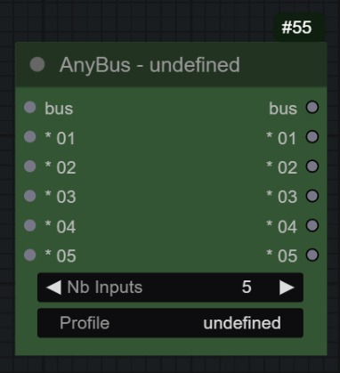
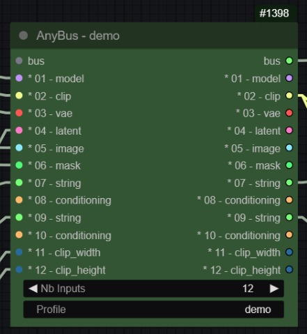

Here is a very simple workflow:

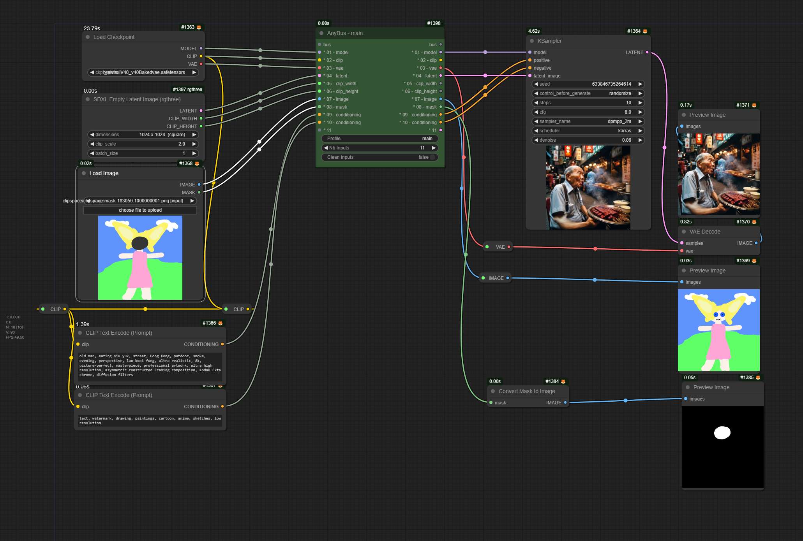

#### **What does it intend to do?**

Any workflow can quickly become messy and difficult to identify easily which output goes to which input. At some point, either you use a custom_node which "hides" the splines for you so you don't feel overwhelmed but will still have some issue identifying which goes where OR you use a Bus node like AnyBus which will clarify your workflow without having to remember the origins of your splines.

The AnyBus Node allows you to apply a profile to your Buses to organize paths in the same workflow. One Bus has a maximum of 25 inputs/outputs.

#### **The profile setting**

The BusNode profile is a mechanism to synchronize BusNodes in the same flow (connected by the `Bus` input/output). All nodes with the same profile name and connected will be synchronized if one of them is modified.

When adding a node, the profile is default. If you have another flow called main, for example, and you connect the bus output of the flow to the input of the default busnode, the main flow will synchronize the main input to the default one and change the profile name to main. This works only for the default node. If you have a node called TextFlow and try to connect main to TextFlow, the connection will be refused. This allows for multiple flows in the same workflow and avoids conflict.

This AnyBus is *dyslexia-friendly* :D

### Text Concatenation

It is meant to allow you to concatenate up to 24 string inputs

### Multiline to List

This return a multiline text as a text, a list of text 1 per line, a count of the number of lines

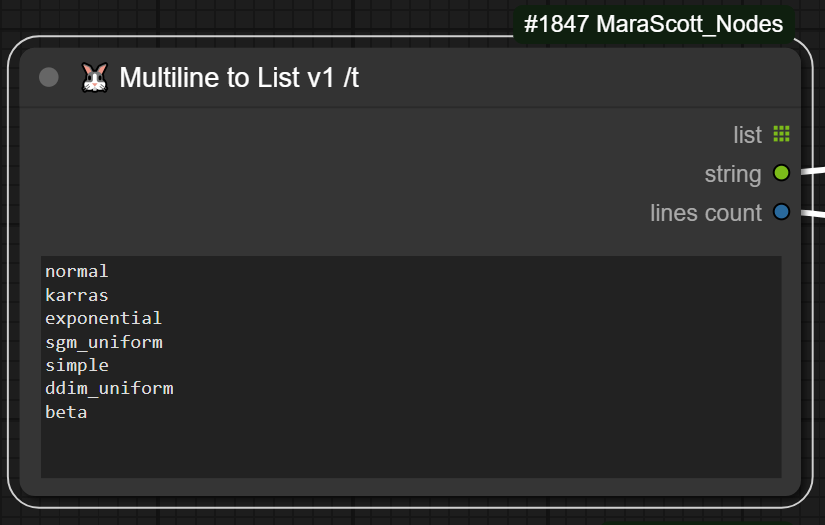

### Display Any - Text

It is meant to display any content within the node + pass the input value as output allow you to use it within a ForLoopOpen/ForLoopClose workflow

### For Loop (Open/Close)

These two nodes allow you to build loops within your workflow and subloops too in order to limitate the needs to repeats sequences in your workflows

#### a Loop

#### a loop and its sub Loop

### McBoaty Node Set (Upscaler, Prompter, Refiner)

McBoaty Node Set (AKA Upscaler, Prompter, Refiner Node set) is an upscaler coupled with a refiner to achieve higher rendering results on a per-tile basis.

You can follow a presentation video on my chanel : [ComfyUI Tutorial: How to Use McBoaty Nodes Set for Upscaling and Refining Images](https://www.youtube.com/watch?v=7hh-JxGVJHc)

#### What does it intend to do?

McBoaty intends to provide the most efficient way to upscale and refine an image for printing purposes. Its core purpose is to upscale an image with minimal to no modification on the upscaled/refined image. For that purpose, using a denoise at 0.27 or maybe 0.35 is the sweet spot. Using multiple x2 upscaler models would also provide a better result than using one x4 model, but that is for you to choose.

#### To which StableDiffusion version is it compatible?

It has been tested successfully with SD1.5, SDXL, SD3; it will probably work with any SD version. Feel free to report issues in the issue section.

#### What's inside?

The McBoaty set of nodes comes with 4 different nodes:

1) An **Upscaler Node** to upscale the input image and slice it into tiles to refine the image on a per-tile approach.

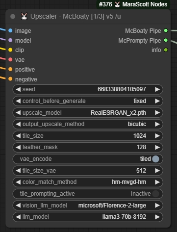

Inputs:

- image: input image
- model, clip, vae, seed: as usual
- positive, negative: required but not used, will be replaced by positive and negative prompts in the near future
- upscale model, output upscale method: as usual with an Upscale (by model) node
- tile size, feather mask: these 2 sizes will be used to slice your upscaled image and define the size of the image the Ksampler will need to refine
- vae encode, tile size vae: do you want to use a tiled vae encoding method and which size
- color match method: do you want to apply a color match from your input image to the final output image after the refining process
- tile prompting active, vision llm model, llm model: currently used to generate the prompt for conditioning, not accurate and will be improved in the future

Outputs:

- McBoaty Pipe: to connect to Refiner input only
- McPrompty Pipe: to connect to TilePrompter input only
- info: Obsolete

2) A **TilePrompter Node** to edit the prompt and denoise level on a per-tile basis.

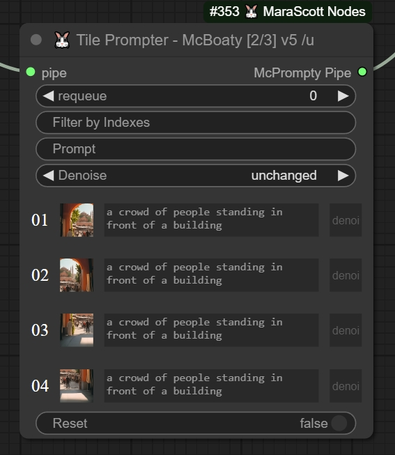

Input:

- pipe: (McPrompty) Pipe output from Upscaler, Refiner, or LargeRefiner

Output:

- McPrompty Pipe: Pipe to connect to Refiner input pipe_prompty only

3) A **Refiner Node** to refine the image based on the settings provided, either via general settings if you don't use the TilePrompter or on a per-tile basis if you do use the TilePrompter.

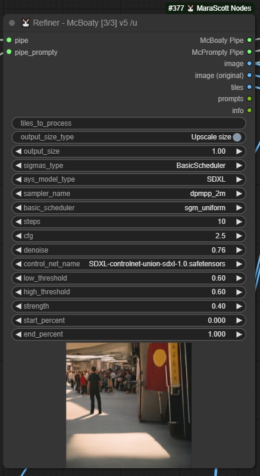

Inputs:

- pipe: McBoaty Pipe output from Upscaler, Refiner, or LargeRefiner
- McPrompty Pipe: to connect to TilePrompter input only
- tiles to process: you can specify an empty input if you want to process all the tiles or specify a tile index shown on the TilePrompter to refine only that tile. The input can specify multiple tiles at once as well either by specifying the tile indexes one by one (`1,2,3,4,...`) or using a range notation like `x-y` (`1-4`, `5-8`) or a combination of those `1,3,4-6,8,9`
- output size type: choose between your Upscale size which will output an image of the size of your Upscale model or use custom size which will use the output size parameter
- output size: this is a coefficient to apply to your input image size as output size if you pick custom size type
- sigmas type: choose between BasicScheduler, SDTurboScheduler, and AlignYourStepScheduler
- ays model type: choose between SD1, SDXL, SD3, SVD (SVD has never been tested) even if you choose a scheduler different from the AYS, you still need to choose your input model type
- sampler name, basic scheduler, steps, cfg, denoise: as usual on a Ksampler node
- control net name, strength, start percent, end percent: as usual using an apply control net node
- low threshold, high threshold: as usual using a canny node

Outputs:

- McBoaty Pipe: to connect to Refiner input only
- McPrompty Pipe: to connect to TilePrompter input only
- image
- image (original)
- tiles
- prompts
- info

4) The fourth node is the **LargeRefiner Node** which is actually the combination of the Upscaler Node + the Refiner Node in one node using the general settings.

Inputs:

- inputs from Upscaler + Refiner

Outputs:

- outputs from Refiner

#### How does it work?

Below is an example of the LargeRefiner being connected to the TilePrompter and refined by a second pass to a Refiner.

Using the Upscaler instead of the LargeRefiner will require using the 1st pass of the refiner with tiles to process at empty value to process all tiles at least once (which the LargeRefiner does by default).

The overall idea is to Upscale (/Refine) your image and slice it to provide each tile to McPrompty the TilePrompter which will allow you to fine-tune your prompt on a per-tile basis as well as the denoise level. Then those parameters are passed to the Refiner which will process those tiles and rebuild your image for the output. Then you can continue the refining on another refiner pass or modify the current TilePrompter parameters to fine-tune the result.

One use case is to push the denoise to 0.76 (maximum denoise recommended with control net activated) in the LargeRefiner then fine-tune the prompt and denoise for the tiles which went too wild and process the tiles you want (specified in the tiles to process settings) again through a second refiner pass.

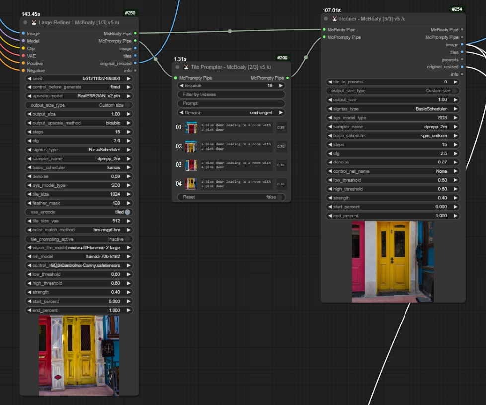

#### Where can I find a functional workflow to test it?

Below is a functional workflow embedded in the image which allows you to test both techniques.

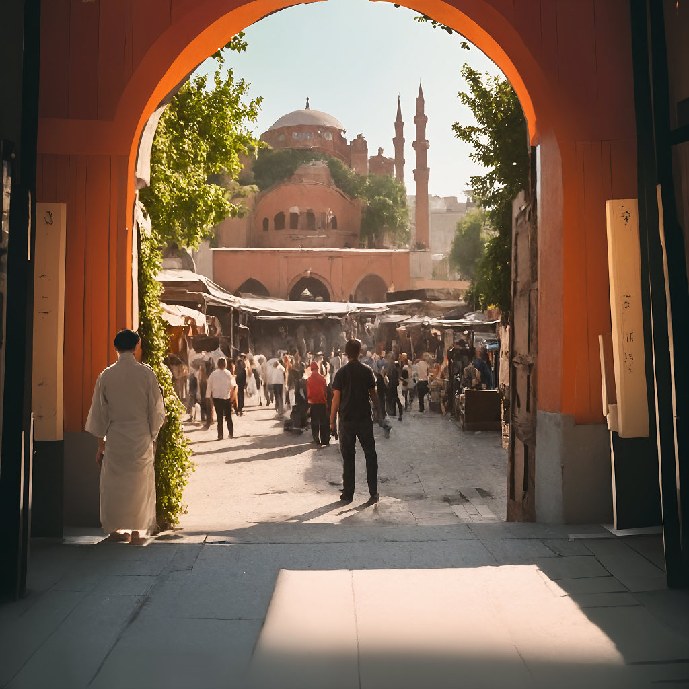

**Learn More about the Name McBoaty**

### McInpainty Node Set (Set & Paster Node) - *description in progress*

McInpainty Node is a set of 2 nodes.

### Get Model Blocks

Workflow

Image generated by modifying model block weights

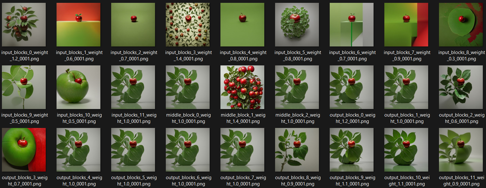

## Benchmark

### Upscaler

[Img Slider for result comparison](https://imgsli.com/Mjc5NDg3/0/1)

| Custom_node             | Execution Time from server start to end of queue | output                                                    | Type     | workflow                                                                          | OS Name                   | Processor                             | Installed Physical Memory (RAM) GB | GPU Name                                      |
| ----------------------- | ------------------------------------------------ | --------------------------------------------------------- | -------- | --------------------------------------------------------------------------------- | ------------------------- | ------------------------------------- | ---------------------------------- | --------------------------------------------- |
| McBoaty LargeRefiner v5 | 98.37                                            | 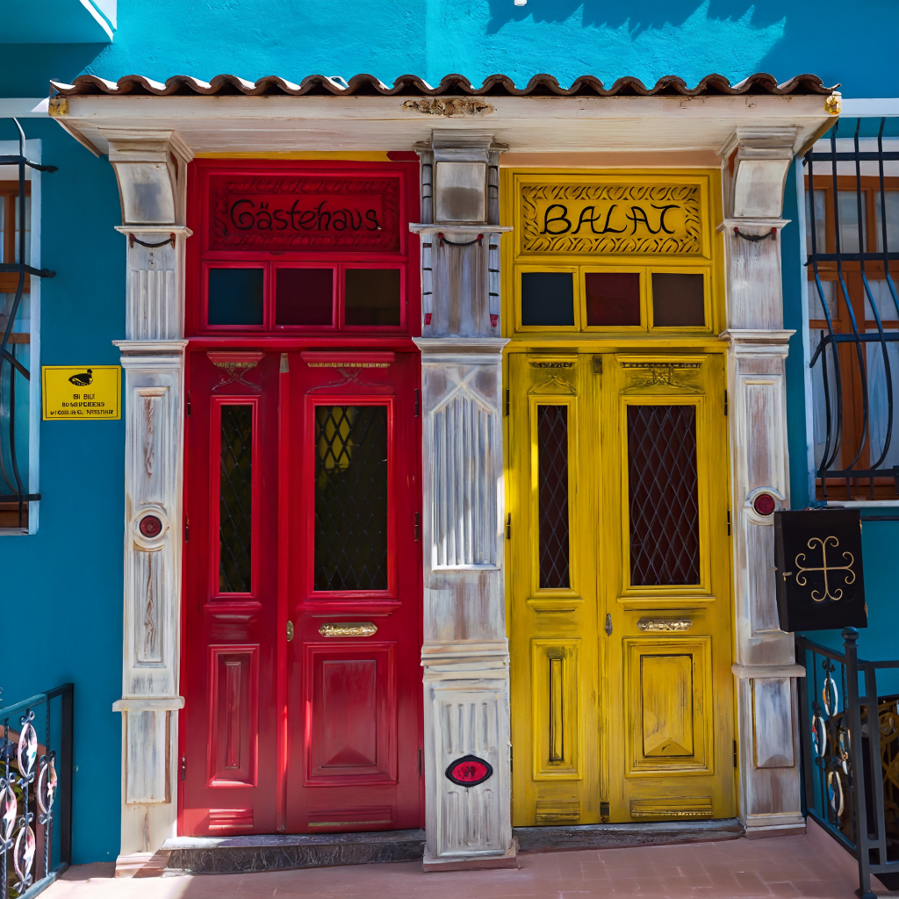 | Upscaler | [benchmark_McBoaty.json](./docs/benchmark/Competitor/McBoaty/benchmark_McBoaty.json) | Microsoft Windows 10 Home | Intel(R) Xeon(R) W-3235 CPU @ 3.30GHz | 41                                 | Red Hat QXL controller NVIDIA Quadro RTX 6000 |
| Supir                   | 70.48                                            |        | Upscaler | [benchmark_SUPIR.json](./docs/benchmark/Competitor/SUPIR/benchmark_SUPIR.json)       | Microsoft Windows 10 Home | Intel(R) Xeon(R) W-3235 CPU @ 3.30GHz | 41                                 | Red Hat QXL controller NVIDIA Quadro RTX 6000 |
| UltimateSDUpscaler      | 47.34                                            | 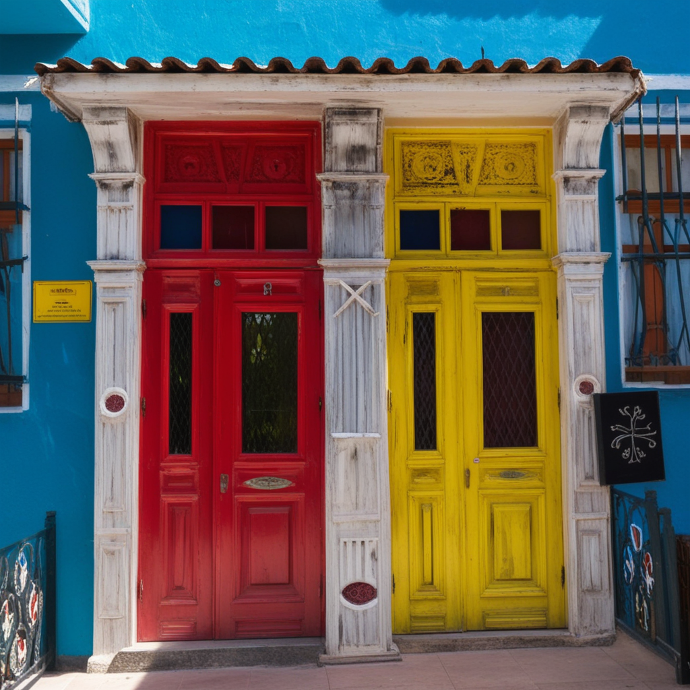          | Upscaler | [benchmark_USDU.json](./docs/benchmark/Competitor/USDU/benchmark_USDU.json)          | Microsoft Windows 10 Home | Intel(R) Xeon(R) W-3235 CPU @ 3.30GHz | 41                                 | Red Hat QXL controller NVIDIA Quadro RTX 6000 |

**Visit this link to see [an Image Slider comparing the 3 results against the original](https://imgsli.com/Mjc5NDg3/0/1)**

# Sponsorship

[❤️ Github Sponsor](https://github.com/sponsors/MaraScott) | [🪙 Paypal](https://www.paypal.me/marascottai)

If you like my work and wish to see updates and new features please consider sponsoring my projects.

Not to mention the documentation and videos tutorials. Check my YouTube Chanel [@MaraScott-AI](https://www.youtube.com/@marascott-ai)

The only way to keep the code open and free is by sponsoring its development. The more sponsorships the more time I can dedicate to my open source projects.

Please consider a [Github Sponsorship](https://github.com/sponsors/MaraScott) or [PayPal donation](https://www.paypal.me/marascottai) (David "MaraScott" Asquiedge). For sponsorships of $50+, let me know if you'd like to be mentioned in this readme file, you can find me on [Fern&#39;s Discord](https://discord.com/invite/t28yZEewrp) or david.asquiedge🐰maracott.ai.

# Special thanks

I would like to thank my [AI Classroom Discord](discord.gg/t28yZEewrp) buddies with a shoutout to:

- [@Fern](https://www.youtube.com/@ferniclestix) to whom I address **A special thanks for his support** in my ComfyUI journey who accepted me into his discord in the first place and tried to put good ideas in my head
- [Rob Adams](https://www.youtube.com/@robadams2451) AKA Treeshark who helped improve McBoaty by providing great insights and always pushing further the limits,
- [@YouFunnyGuys](discord.gg/t28yZEewrp) From the discord channel for his invaluable contribution and exceptional testing skills,

## Node related Thanks

### AnyBus

- Comfyanonymous with his [ComfyUI](https://github.com/comfyanonymous/ComfyUI)
- DrLtData with his [Custom nodes Manager](https://github.com/ltdrdata/ComfyUI-Manager),
- WASasquatch with his [Was Node Suite](https://github.com/WASasquatch/was-node-suite-comfyui)
- Kijai with his [Get/Set nodes](https://github.com/kijai/ComfyUI-KJNodes),
- Trung0246 with his [Highway node](https://github.com/Trung0246/ComfyUI-0246),
- Jags with his [support](https://www.youtube.com/channel/UCLXyz7oWNKx-Dp7Ba4v5ZZg)

### McBoaty

- [Rob Adams](https://www.youtube.com/@robadams2451) AKA Treeshark who provided the workflow in the first place which I converted into a ComfyUI Node, you can find his original workflow presentation in his YouTube video: [Advanced UpScaling in ComfyUI](https://www.youtube.com/watch?v=HStp7u682mE),
- DrLtData with his [ImpactPack](https://github.com/ltdrdata/ComfyUI-Impact-Pack),
- Kijai with his [ColorMatch node](https://github.com/kijai/ComfyUI-KJNodes/blob/main/nodes/image_nodes.py)

### McInpainty

- Chflame163 with his [LayerStyle](https://github.com/chflame163/ComfyUI_LayerStyle) Nodes

*I might have forgotten some other people, please contact me if you want to appear here and please forgive me.*

---

If anybody is interested in using these nodes, I'm following up on feature requests via the issues.
If you have Node ideas, feel free to make a request in the issues.

## Star History

<a href="https://star-history.com/#MaraScott/ComfyUI_MaraScott_Nodes&Date">
 <picture>
   <source media="(prefers-color-scheme: dark)" srcset="https://api.star-history.com/svg?repos=MaraScott/ComfyUI_MaraScott_Nodes&type=Date&theme=dark" />
   <source media="(prefers-color-scheme: light)" srcset="https://api.star-history.com/svg?repos=MaraScott/ComfyUI_MaraScott_Nodes&type=Date" />
   
 </picture>
</a>
